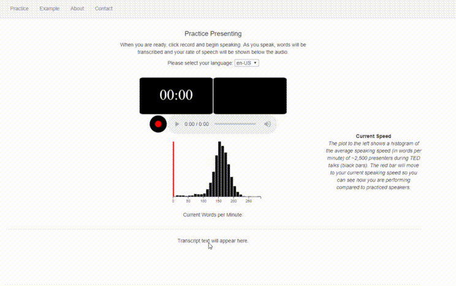
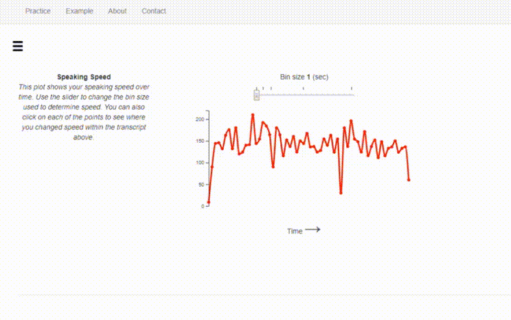

# talk-like-ted

Practice giving spoken presentations and get feedback in real time

## About

This repository contains code to generate a web app that helps people give better spoken presentations. It uses flask and socketio to stream a user's audio to Google's Speech-to-Text API and gives the user feedback on their speech, including monitoring their speaking rate and identifying overused words. In addition, it uses NLP to parse a user's speech into topics, and gives the user feedback about how long they spent talking about individual topics.

## Demos

### Real time pace and speech transcription

Once a user clicks record and begins talking, their speaking pace is displayed by a sliding red bar which is overlayed onto a histogram of average speaking rates for ~2500 TED talkers. Their transcript is also updated in real time and shown below their pace.



### Word usage

Users can see an interactive visualization of their transcript, identify over-used words, and see where those words were spoken.


### Pace over time

Users can see how quickly they were speaking over time and identify those areas within their transcript.



### Topic Modeling

Finally, users can set a number of target topics for their presentation and see how long they spent talking about each of those topics. The app automatically determines what topics were talked about using latent dirichlet allocation (LDA) and displays the words that are characteristic of that topic.


## Installation

First, clone this repository:

```bash
git clone https://github.com/regginold/talk-like-ted.git
```

To run this app, you must have a valid account on Google Cloud Console, with the *Cloud Speech-to-Text API* enabled. Create a project and enable this API, then create a new service account key and save this key somewhere within the repo.

I created a new top-level folder called `keys/` and stored the service key there (note that `keys/` is in the `.gitignore` file, so it won't be tracked by git).

Then, edit the `Dockerfile`, and update the `GOOGLE_KEY_FILE` with the path to the service account key you just downloaded and `GOOGLE_PROJECT_ID` to the ID of the project you just created.

Finally, build the docker image using `docker-compose`:

```bash
docker-compose build
```

and run it as a container:

```bash
docker-compose up
```

Then go to `localhost:8000` to use the app.